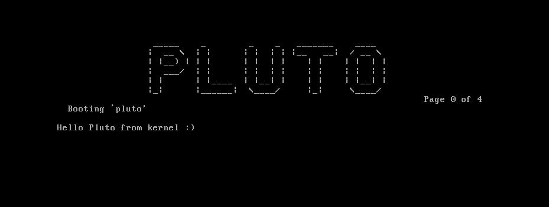

# Pluto

[](https://github.com/SamTebbs33/pluto/actions)

Pluto is a kernel written almost entirely in [Zig](https://github.com/ziglang/zig) and supports x86 and aarch64, with an x86_64 backend being planned.



## Goals

* **Should be written in Zig as much as possible**. Assembly should only be used where required for functionality or performance reasons.
* **Light and performant**. The kernel should be usable both on embedded and desktop class CPUs, made possible by it being lightweight and modular.
* **Basic utilities will be written in Zig**. This includes a basic text editor and shell, and will be part of the filesystem external to the kernel itself.
* **Easy to port**. The kernel is oblivious to the underlying architecture, meaning that ports only need to implement the defined interface and they should work without a hitch.

All of these goals will benefit from the features of Zig.

## Build

Requires a master build of Zig ([downloaded](https://ziglang.org/download) or [built from source](https://github.com/ziglang/zig#building-from-source)). Building for x86 requires *xorriso* and the grub tools (such as *grub-mkrescue*) and aarch64 requires *aarch64-linux-gnu-objcopy* (part of *aarch64-linux-gnu-binutils*). A *qemu-system* binary compatible with your chosen target is required to run the kernel (e.g. *qemu-system-i386*).

```Shell
zig build
```

## Run

```Shell
zig build run
```

or if you want to wait for a gdb connection:

```Shell
zig build debug-run
```

## Debug

Launch a gdb-multiarch instance and connect to qemu.

```Shell
zig build debug
```

## Unit testing

Run the unit tests.

```Shell
zig build test
```

## Runtime testing

Run the runtime tests.

```Shell
zig build rt-test -Dtest-mode=<MODE>
```

Available test modes:

* `None`: This is the default, this will run the OS normally.
* `Initialisation`: Run the OS's initialisation runtime tests to ensure the OS is properly set up.
* `Panic`: Run the panic runtime test.

## Options

* `-D[build-mode]=`: Boolean (default `false`).
  * **build**: Build a certain build mode (*release-safe*, *release-fast*, *release-small*). Don't set in order to use the *debug* build mode.
  * **test**: Test a certain build mode (*release-safe*, *release-fast*, *release-small*). Don't set in order to use the *debug* build mode.
* `-Dtarget=`: String (default `i386-freestanding`). The standard target options for building with zig. Currently supported targets:
  * `i386-freestanding`
  * `cortex_a53-freestanding`
* `-Ddisable-display`: Boolean (default `false`)
  * This disables the display output of QEMU.

## Contribution

We welcome all contributions, be it bug reports, feature suggestions or pull requests. We follow the style mandated by zig fmt so make sure you've run `zig fmt` on your code before submitting it.

We also like to order a file's members (public after non-public):

1. imports
2. type definitions
3. constants
4. variables
5. inline functions
6. functions
7. entry point/init function

More styling information is available on the [wiki](https://github.com/SamTebbs33/pluto/wiki/Code-Styling-(Detailed))
